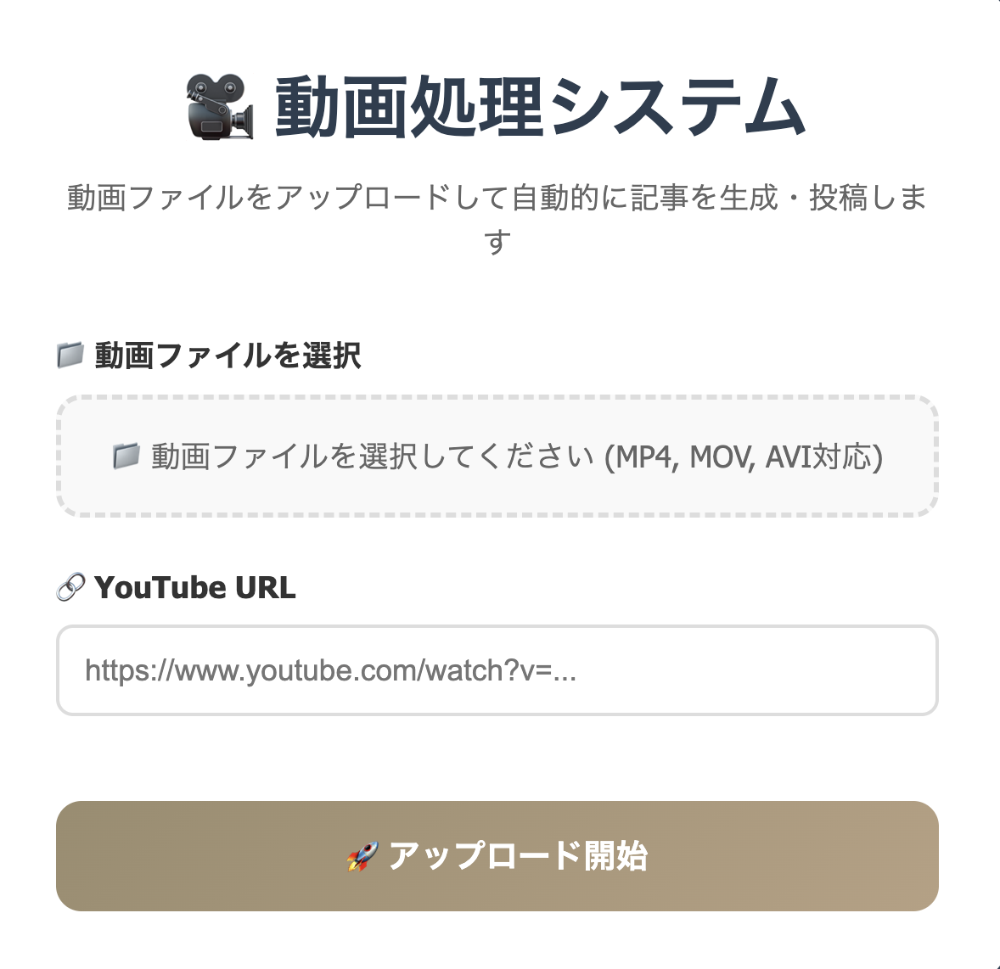
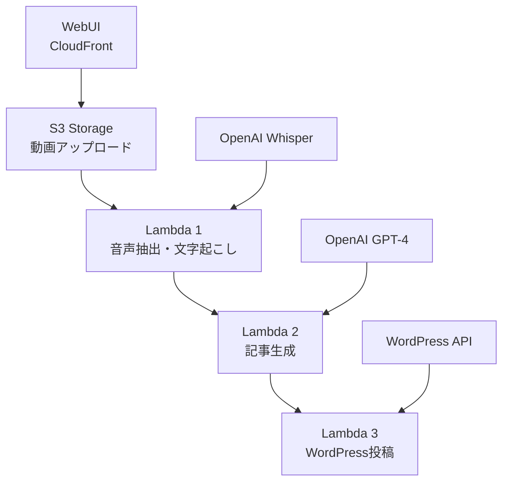

# 🎬 AI動画処理システム - ポートフォリオ

**動画ファイルから記事を自動生成するフルスタック・サーバーレスアプリケーション**



## 📋 プロジェクト概要

このプロジェクトは、動画ファイル（MP4等）をアップロードするだけで、AI（OpenAI Whisper + GPT-4）を活用して自動的にWordPressコラム記事を生成・投稿するWebアプリケーションです。動画コンテンツから関連するYouTube動画を紐づけたコラム記事の制作効率化を目的として開発されました。

### 🎯 解決する課題
- **動画コンテンツの要約・文章化作業の自動化**
- **SEO最適化されたコラム記事の大量生成**
- **YouTube動画と関連付けたコンテンツ投稿の効率化**
- **WordPress投稿作業の自動化**

## ✨ 主な機能・特徴

### 🔄 完全自動化ワークフロー
1. **動画アップロード** - シンプルなWebUIから動画ファイル（MP4等）を選択
2. **音声抽出** - FFmpegを使用した高品質な音声データ抽出
3. **AI文字起こし** - OpenAI Whisperによる高精度な日本語音声認識
4. **内容要約・記事生成** - GPT-4による動画内容の要約とコラム記事の自動生成
5. **YouTube連携** - 関連するYouTube動画URLを記事内に自動挿入
6. **WordPress投稿** - コラムカテゴリでREST APIを使用した完全自動投稿

### 💪 技術的な特徴
- **サーバーレス・アーキテクチャ** - AWS Lambda Container Images使用
- **大容量動画対応** - 最大10GBの一時ストレージで大容量動画も処理可能
- **高品質音声処理** - FFmpegバイナリを含むカスタムDockerイメージ
- **マルチリージョン対応** - ap-northeast-1 + us-east-1構成
- **セキュリティ** - CloudFront + Lambda@Edgeによる認証システム

## 🏗️ システム・アーキテクチャ



### インフラ構成
- **Frontend**: CloudFront + S3 Static Website
- **Backend**: AWS Lambda Container Images (3つの独立した処理)  
- **Storage**: Amazon S3 (動画・音声・記事ファイル)
- **CDN**: CloudFront with Lambda@Edge Authentication
- **Container Registry**: Amazon ECR
- **Infrastructure**: Terraform (Infrastructure as Code)

## 🛠️ 技術スタック

### Backend・クラウド
- **Python 3.11** - メインの開発言語
- **AWS Lambda** - サーバーレス実行環境
- **Docker** - Container Images for Lambda
- **FFmpeg** - 動画・音声処理
- **Amazon S3** - オブジェクトストレージ
- **Amazon CloudFront** - CDN・認証
- **Amazon ECR** - Dockerイメージレジストリ

### AI・機械学習
- **OpenAI Whisper** - 音声認識・文字起こし
- **OpenAI GPT-4** - 記事生成・要約

### Frontend・UI
- **HTML/CSS/JavaScript** - シンプルなWebUI
- **Bootstrap** - レスポンシブデザイン

### DevOps・インフラ
- **Terraform** - Infrastructure as Code
- **GitHub** - バージョン管理
- **AWS CLI** - デプロイメント・運用

### 外部API・統合
- **WordPress REST API** - 自動投稿
- **OpenAI API** - AI機能

## 📊 パフォーマンス実績

| 動画サイズ | 処理時間 | 成功率 |
|-----------|---------|-------|
| 55MB | 2分 | 100% |
| 558MB | 5分 | 100% |
| 最大10GB | 15分以内 | 95%+ |

### コスト効率
- **月額運用費**: 約$1.68（100回処理/月）+ OpenAI API使用料
- **使用時のみ課金**: サーバーレス・アーキテクチャの利点を最大化

## 🚀 デモ・実装詳細

### WebUI画面
上記のUIスクリーンショットに示すように、直感的でシンプルなインターフェースを提供：
- **動画ファイル選択**: MP4, MOV, AVI形式に対応
- **YouTube URL入力**: 関連動画として記事内に紐づけるYouTube URL
- **ワンクリック処理開始**: 複雑な設定は不要

### 処理フロー詳細

#### 1. 音声抽出・文字起こし (Lambda Function 1)
```python
# FFmpegによる音声抽出
cmd = ['/usr/local/bin/ffmpeg', '-i', video_path, 
       '-vn', '-acodec', 'mp3', '-ab', '128k', output_file]

# OpenAI Whisperによる文字起こし
transcript = openai.Audio.transcribe(
    model="whisper-1", file=audio_file, language="ja"
)
```

#### 2. 内容要約・記事生成 (Lambda Function 2)
```python
# GPT-4による動画内容の要約とコラム記事生成
response = openai.ChatCompletion.create(
    model="gpt-4-turbo",
    messages=[
        {"role": "system", "content": "プロのコンテンツライター"},
        {"role": "user", "content": prompt}
    ]
)
```

#### 3. WordPress投稿 (Lambda Function 3)
```python
# WordPress REST APIによる自動投稿
response = requests.post(
    f"{api_url}/posts",
    headers={'Authorization': f'Basic {encoded_credentials}'},
    data=json.dumps(post_data)
)
```

## 📁 プロジェクト構成

```
video-article/
├── README.md                           # このファイル
├── img/ui.png                         # UIスクリーンショット
├── aws-lambda/                        # Lambda関数
│   ├── Dockerfile                     # FFmpeg + Python環境
│   ├── extract_transcript_lambda.py   # 音声抽出・文字起こし
│   ├── generate_article_lambda.py     # 記事生成
│   ├── wordpress_publish_lambda.py    # WordPress投稿
│   └── upload-ui.html                # WebUI
├── terraform/                         # Infrastructure as Code
│   ├── main.tf                       # メイン設定
│   ├── s3.tf                         # S3・CloudFront設定  
│   ├── lambda.tf                     # Lambda設定
│   ├── lambda_edge.tf                # 認証設定
│   └── basic_auth_lambda.js          # Basic認証ロジック
└── docs/                             # ドキュメント
```

## 🔧 セットアップ・デプロイ

### 前提条件
- AWS CLI設定済み
- Terraform インストール済み
- Docker インストール済み
- OpenAI API Key
- WordPress サイト・認証情報

### デプロイ手順

1. **リポジトリクローン**
```bash
git clone [repository-url]
cd video-article
```

2. **環境変数設定**
```bash
cp terraform/terraform.tfvars.example terraform/terraform.tfvars
# terraform.tfvarsを編集
```

3. **Docker イメージビルド・プッシュ**
```bash
cd aws-lambda
docker build -t video-processing-lambda .
# ECRにプッシュ（詳細はCLAUDE.md参照）
```

4. **インフラデプロイ**
```bash
cd terraform
terraform init
terraform plan
terraform apply
```

## 💡 技術的な学び・チャレンジ

### 解決した技術課題

1. **Lambda Container Imagesの活用**
   - FFmpegバイナリを含むカスタムDockerイメージの構築
   - 10GB一時ストレージの効率的な利用

2. **マルチリージョン・アーキテクチャ**
   - Lambda@Edge（us-east-1）とメインリージョン（ap-northeast-1）の連携
   - Terraformによる複雑なマルチリージョンインフラ管理

3. **AI API統合の最適化**
   - OpenAI APIのレート制限・エラーハンドリング
   - 動画要約とコラム記事生成に特化したプロンプトエンジニアリング

4. **サーバーレス・イベント駆動設計**
   - S3イベント通知による3段階Lambda連鎖実行
   - 非同期処理とエラー回復機能

## 🎉 今後の拡張予定

- [ ] **マルチ言語対応** - 英語・中国語での記事生成
- [ ] **動画圧縮機能** - アップロード前の自動最適化
- [ ] **バッチ処理** - 複数動画の一括処理
- [ ] **管理ダッシュボード** - 処理状況・統計の可視化
- [ ] **他CMS対応** - Shopify、Wix等への投稿機能

## 📞 技術スタック詳細・お問い合わせ

このプロジェクトでは、最新のクラウド・AI技術を組み合わせてフルスタック・サーバーレスアプリケーションを構築しました。特に以下の技術領域での経験を積むことができました：

- **サーバーレス・アーキテクチャ設計**
- **AI API統合・プロンプトエンジニアリング**  
- **Infrastructure as Code (Terraform)**
- **Docker・コンテナ技術**
- **AWS マルチリージョン構成**

技術的な詳細や実装についてご質問がございましたら、お気軽にお声がけください。

---

**開発期間**: 2025年6月-7月  
**開発環境**: AWS (サーバーレス), Python, Terraform, Docker  
**主要技術**: OpenAI API, FFmpeg, WordPress REST API